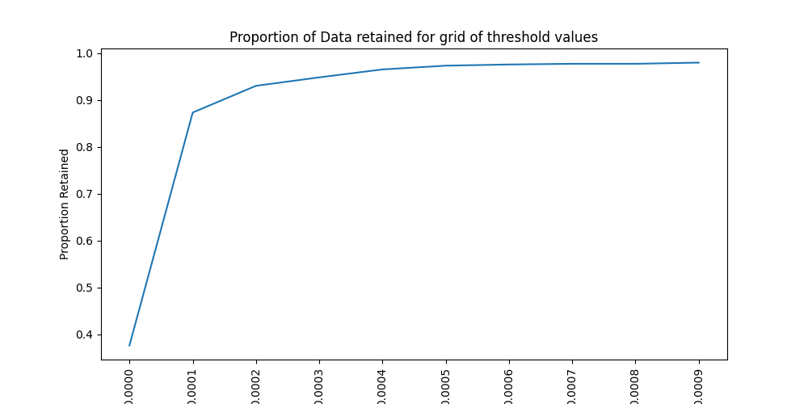

# `pysmatch`

[](https://badge.fury.io/py/pysmatch)
[](https://pepy.tech/project/pysmatch)


**Propensity Score Matching (PSM)** is a statistical technique used to address selection bias in observational studies, particularly in the assessment of treatment effects. It involves calculating the propensity score—the probability of receiving treatment given observed covariates—for each unit in both treatment and control groups. Units are then matched based on these scores, making the groups more comparable on the covariates. This method attempts to mimic the effects of a randomized experiment in non-randomized study designs, aiming to estimate the causal effects of an intervention.


`pysmatch` is an improved and extended version of [`pymatch`](https://github.com/benmiroglio/pymatch), providing a robust tool for propensity score matching in Python. This package fixes known bugs from the original project and introduces new features such as parallel computing and model selection, enhancing performance and flexibility.

## Multilingual Readme
[English|[中文](https://github.com/mhcone/pysmatch/blob/main/README_CHINESE.md)]

## Features

- **Bug Fixes**: Addresses known issues from the original `pymatch` project.
- **Parallel Computing**: Speeds up computation by utilizing multiple CPU cores.
- **Model Selection**: Supports linear models (logistic regression), tree-based models (e.g., CatBoost), and K-Nearest Neighbors (KNN) for propensity score estimation.

## Installation

`pysmatch` is available on PyPI and can be installed using pip:

```bash
pip install pysmatch
```

#

The best way to get familiar with the package is to work through an example. The example below leaves out much of the theory behind matching and focuses on the application within `pysmatch`. If interested, Sekhon gives a nice overview in his [Introduction to the Matching package in R](http://sekhon.berkeley.edu/papers/MatchingJSS.pdf).

 **Example**


In this example, we aim to match Lending Club users who fully paid off loans (control group) with those who defaulted (test group), based on observable characteristics. This allows us to analyze the causal effect of defaulting on variables such as user sentiment, controlling for confounding variables.


**Table of Contents**


​	•	[Data Preparation](#data-preparation)

​	•	[Fitting Propensity Score Models](#fitting-propensity-score-models)

​	•	[Predicting Propensity Scores](#predicting-propensity-scores)

​	•	[Tuning the Matching Threshold](#tuning-the-matching-threshold)

​	•	[Matching the Data](#matching-the-data)

​	•	[Assessing the Match Quality](#assessing-the-match-quality)

​	•	[Conclusion](#conclusion)

​	•	[Additional Resources](#additional-resources)

​	•	[Contributing](#contributing)

​	•	[License](#license)

----

## **Data Preparation**


First, we import the necessary libraries and suppress any warnings for cleaner output.

```python
import warnings
warnings.filterwarnings('ignore')

import pandas as pd
import numpy as np
from pysmatch.Matcher import Matcher

%matplotlib inline
```
Next, we load the dataset and select a subset of columns relevant for our analysis.


Load the dataset (`loan.csv`) and select a subset of columns.

```python
# Define the file path and the fields to load
path = "loan.csv"
fields = [
    "loan_amnt",
    "funded_amnt",
    "funded_amnt_inv",
    "term",
    "int_rate",
    "installment",
    "grade",
    "sub_grade",
    "loan_status"
]

# Load the data
data = pd.read_csv(path, usecols=fields)
```

## **Understanding the Variables**


​	•	**loan_amnt**: The listed amount of the loan applied for by the borrower.

​	•	**funded_amnt**: The total amount committed to that loan at that point in time.

​	•	**funded_amnt_inv**: The total amount funded by investors for that loan.

​	•	**term**: The number of payments on the loan in months.

​	•	**int_rate**: The interest rate on the loan.

​	•	**installment**: The monthly payment owed by the borrower.

​	•	**grade**: Lending Club assigned loan grade.

​	•	**sub_grade**: Lending Club assigned loan subgrade.

​	•	**loan_status**: Current status of the loan.


**Creating Test and Control Groups**


We create two groups:


​	•	**Test Group**: Users who defaulted on their loans.

​	•	**Control Group**: Users who fully paid off their loans.


We then encode the loan_status as a binary treatment indicator.

```python
# Create test group (defaulted loans)
test = data[data.loan_status == "Default"].copy()
test['loan_status'] = 1  # Treatment group indicator

# Create control group (fully paid loans)
control = data[data.loan_status == "Fully Paid"].copy()
control['loan_status'] = 0  # Control group indicator
```


----

##  **Fitting Propensity Score Models**


We initialize the Matcher object, specifying the outcome variable (yvar) and any variables to exclude from the model (e.g., unique identifiers).

```python
# Initialize the Matcher
m = Matcher(test, control, yvar="loan_status", exclude=[])
```

Output:

```python
Formula:
loan_status ~ loan_amnt + funded_amnt + funded_amnt_inv + term + int_rate + installment + grade + sub_grade
n majority: 207723
n minority: 1219
```
## **Addressing Class Imbalance**


Our data exhibits significant class imbalance, with the majority group (fully paid loans) greatly outnumbering the minority group (defaulted loans). To address this, we set balance=True when fitting the propensity score models, which tells pysmatch to undersample the majority class to create balanced datasets for model training.


We also specify nmodels=100 to train 100 models on different random samples of the data, ensuring that a broader portion of the majority class is used in model training.


## **Model Selection and Parallel Computing**


With pysmatch, you can choose between linear models (logistic regression), tree-based models (e.g., CatBoost), and K-Nearest Neighbors (KNN) for propensity score estimation. You can also leverage parallel computing to speed up model fitting by specifying the number of jobs (n_jobs).
```python
# Set random seed for reproducibility
np.random.seed(42)

# Fit propensity score models
m.fit_scores(balance=True, nmodels=100, n_jobs=5, model_type='linear')# model_type='linear', model_type='tree'
```

Output:

```python
Fitting 100 Models on Balanced Samples...
Average Accuracy: 70.21%
```

**Note**: The average accuracy indicates the separability of the classes given the observed features. An accuracy significantly above 50% suggests that matching is appropriate.


## **Predicting Propensity Scores**


After fitting the models, we predict propensity scores for all observations in our dataset.

```python
# Predict propensity scores
m.predict_scores()
```

We can visualize the distribution of propensity scores for the test and control groups.

```python
# Plot propensity score distributions
m.plot_scores()
```


**Interpretation**: The plot shows that the test group (defaulted loans) generally has higher propensity scores than the control group, indicating that the model can distinguish between the two groups based on the observed features.


---

## **Tuning the Matching Threshold**


The matching threshold determines how similar two propensity scores must be to be considered a match. A smaller threshold results in closer matches but may reduce the number of matched pairs.


We use the tune_threshold method to find an appropriate threshold that balances match quality and sample size.

```python
m.tune_threshold(method='random')
```




Based on the plot, a threshold of 0.0001 retains 100% of the test group. We will use this threshold for matching.

---

## **Matching the Data**


We have enhanced the matching method to include an option to control whether matching is done with or without replacement. You can specify the matching method, the number of matches per observation, the threshold, and whether to allow replacement in the matching process.
```python
# Perform matching
m.match(method="min", nmatches=1, threshold=0.0001, replacement=False)
```
This command will execute the matching process using the minimum difference strategy, ensuring 1:1 matching without replacement. The threshold is set to determine how close the propensity scores need to be to consider a match suitable.

**Understanding the Matching Parameters**


​	•	**method**:

​	•	"min": Finds the closest match based on the smallest difference in propensity scores.

​	•	"random": Selects a random match within the threshold.

​	•	**nmatches**: Number of matches to find for each observation in the test group.

​	•	**threshold**: Maximum allowed difference in propensity scores between matched pairs.

​	•   **replacement**: Whether to allow replacement in the matching process.

## **Handling Multiple Matches**


Matching with replacement means a control observation can be matched to multiple test observations. We can assess how frequently control observations are used in the matched dataset.


```python
# Assess record frequency in matches
m.record_frequency()
```


Output:

```python
   freq  n_records
0     1       2264
1     2         68
2     3         10
3     4          2
```

To account for this in subsequent analyses, we assign weights to each observation based on their frequency.

```python
# Assign weights to matched data
m.assign_weight_vector()
```

## **Examining the Matched Data**

```python
# View a sample of the matched data
m.matched_data.sort_values("match_id").head(6)
```
<table border="1" class="dataframe">
  <thead>
    <tr style="text-align: right;">
      <th></th>
      <th>record_id</th>
      <th>weight</th>
      <th>loan_amnt</th>
      <th>funded_amnt</th>
      <th>funded_amnt_inv</th>
      <th>term</th>
      <th>int_rate</th>
      <th>installment</th>
      <th>grade</th>
      <th>sub_grade</th>
      <th>loan_status</th>
      <th>scores</th>
      <th>match_id</th>
    </tr>
  </thead>
  <tbody>
    <tr>
      <th>0</th>
      <td>0</td>
      <td>1.0</td>
      <td>18000.0</td>
      <td>18000.0</td>
      <td>17975.000000</td>
      <td>60 months</td>
      <td>17.27</td>
      <td>449.97</td>
      <td>D</td>
      <td>D3</td>
      <td>1</td>
      <td>0.644783</td>
      <td>0</td>
    </tr>
    <tr>
      <th>2192</th>
      <td>191970</td>
      <td>1.0</td>
      <td>2275.0</td>
      <td>2275.0</td>
      <td>2275.000000</td>
      <td>36 months</td>
      <td>16.55</td>
      <td>80.61</td>
      <td>D</td>
      <td>D2</td>
      <td>0</td>
      <td>0.644784</td>
      <td>0</td>
    </tr>
    <tr>
      <th>1488</th>
      <td>80665</td>
      <td>1.0</td>
      <td>18400.0</td>
      <td>18400.0</td>
      <td>18250.000000</td>
      <td>36 months</td>
      <td>16.29</td>
      <td>649.53</td>
      <td>C</td>
      <td>C4</td>
      <td>0</td>
      <td>0.173057</td>
      <td>1</td>
    </tr>
    <tr>
      <th>1</th>
      <td>1</td>
      <td>1.0</td>
      <td>21250.0</td>
      <td>21250.0</td>
      <td>21003.604048</td>
      <td>60 months</td>
      <td>14.27</td>
      <td>497.43</td>
      <td>C</td>
      <td>C2</td>
      <td>1</td>
      <td>0.173054</td>
      <td>1</td>
    </tr>
    <tr>
      <th>2</th>
      <td>2</td>
      <td>1.0</td>
      <td>5600.0</td>
      <td>5600.0</td>
      <td>5600.000000</td>
      <td>60 months</td>
      <td>15.99</td>
      <td>136.16</td>
      <td>D</td>
      <td>D2</td>
      <td>1</td>
      <td>0.777273</td>
      <td>2</td>
    </tr>
    <tr>
      <th>1828</th>
      <td>153742</td>
      <td>1.0</td>
      <td>12000.0</td>
      <td>12000.0</td>
      <td>12000.000000</td>
      <td>60 months</td>
      <td>18.24</td>
      <td>306.30</td>
      <td>D</td>
      <td>D5</td>
      <td>0</td>
      <td>0.777270</td>
      <td>2</td>
    </tr>
  </tbody>
</table>

	•	record_id: Unique identifier for each observation.
	•	weight: Inverse of the frequency of the control observation in the matched dataset.
	•	match_id: Identifier for matched pairs.


---

## **Assessing the Match Quality**


After matching, it’s crucial to assess whether the covariates are balanced between the test and control groups.


**Categorical Variables**


We compare the distribution of categorical variables before and after matching using Chi-Square tests and proportional difference plots.

```python
# Compare categorical variables
categorical_results = m.compare_categorical(return_table=True)
```


**Interpretation**: The p-values after matching are all above 0.05, indicating that we cannot reject the null hypothesis that the distributions are independent of the group label. The proportional differences have also decreased significantly.


**Continuous Variables**


For continuous variables, we use Empirical Cumulative Distribution Functions (ECDFs) and statistical tests like the Kolmogorov-Smirnov test.

```python
# Compare continuous variables
continuous_results = m.compare_continuous(return_table=True)
```

**Interpretation**: After matching, the ECDFs of the test and control groups are nearly identical, and the p-values from the statistical tests are above 0.05, indicating good balance.


**Results Summary**

```python
# Display categorical results
print(categorical_results)
```

<table border="1" class="dataframe">
  <thead>
    <tr style="text-align: right;">
      <th></th>
      <th>var</th>
      <th>before</th>
      <th>after</th>
    </tr>
  </thead>
  <tbody>
    <tr>
      <th>0</th>
      <td>term</td>
      <td>0.0</td>
      <td>0.433155</td>
    </tr>
    <tr>
      <th>1</th>
      <td>grade</td>
      <td>0.0</td>
      <td>0.532530</td>
    </tr>
    <tr>
      <th>2</th>
      <td>sub_grade</td>
      <td>0.0</td>
      <td>0.986986</td>
    </tr>
  </tbody>
</table>


```python
# Display continuous results
print(continuous_results)
```


<table border="1" class="dataframe">
  <thead>
    <tr style="text-align: right;">
      <th></th>
      <th>var</th>
      <th>ks_before</th>
      <th>ks_after</th>
      <th>grouped_chisqr_before</th>
      <th>grouped_chisqr_after</th>
      <th>std_median_diff_before</th>
      <th>std_median_diff_after</th>
      <th>std_mean_diff_before</th>
      <th>std_mean_diff_after</th>
    </tr>
  </thead>
  <tbody>
    <tr>
      <th>0</th>
      <td>loan_amnt</td>
      <td>0.0</td>
      <td>0.530</td>
      <td>0.000</td>
      <td>1.000</td>
      <td>0.207814</td>
      <td>0.067942</td>
      <td>0.229215</td>
      <td>0.013929</td>
    </tr>
    <tr>
      <th>1</th>
      <td>funded_amnt</td>
      <td>0.0</td>
      <td>0.541</td>
      <td>0.000</td>
      <td>1.000</td>
      <td>0.208364</td>
      <td>0.067942</td>
      <td>0.234735</td>
      <td>0.013929</td>
    </tr>
    <tr>
      <th>2</th>
      <td>funded_amnt_inv</td>
      <td>0.0</td>
      <td>0.573</td>
      <td>0.933</td>
      <td>1.000</td>
      <td>0.242035</td>
      <td>0.067961</td>
      <td>0.244418</td>
      <td>0.013981</td>
    </tr>
    <tr>
      <th>3</th>
      <td>int_rate</td>
      <td>0.0</td>
      <td>0.109</td>
      <td>0.000</td>
      <td>0.349</td>
      <td>0.673904</td>
      <td>0.091925</td>
      <td>0.670445</td>
      <td>0.079891</td>
    </tr>
    <tr>
      <th>4</th>
      <td>installment</td>
      <td>0.0</td>
      <td>0.428</td>
      <td>0.004</td>
      <td>1.000</td>
      <td>0.169177</td>
      <td>0.042140</td>
      <td>0.157699</td>
      <td>0.014590</td>
    </tr>
  </tbody>
</table>

## **Conclusion**


Using pysmatch, we successfully matched users who defaulted on loans with those who fully paid off loans, achieving balance across all covariates. This balanced dataset can now be used for causal inference or further analysis, such as assessing the impact of defaulting on user sentiment.


**Note**: In real-world applications, achieving perfect balance may not always be possible. In such cases, consider adjusting matching parameters or including additional covariates. You may also control for residual imbalance in subsequent analyses.


## **Additional Resources**


​	•	**Sekhon, J. S.** (2011). *Multivariate and propensity score matching software with automated balance optimization: The Matching package for R*. Journal of Statistical Software, 42(7), 1-52. [Link](http://sekhon.berkeley.edu/papers/MatchingJSS.pdf)

​	•	**Rosenbaum, P. R., & Rubin, D. B.** (1983). *The central role of the propensity score in observational studies for causal effects*. Biometrika, 70(1), 41-55.


## **Contributing**


We welcome contributions from the community. If you encounter any issues or have suggestions for improvements, please submit an issue or a pull request on GitHub.


**How to Contribute**


​	1.	Fork the repository.

​	2.	Create a new branch for your feature or bugfix.

​	3.	Commit your changes with clear messages.

​	4.	Submit a pull request to the main repository.


## **License**


pysmatch is licensed under the MIT License.


**Disclaimer**: The data used in this example is for demonstration purposes only. Ensure that you have the rights and permissions to use any datasets in your analyses.
