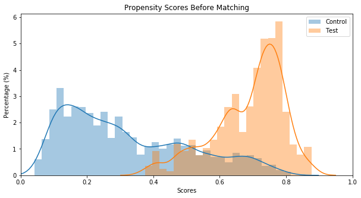
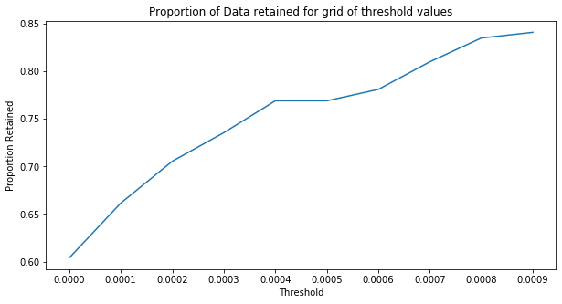

### pysmatch 

本项目基于
pymatch  https://github.com/benmiroglio/pymatch 进行修改；原项目无法运行且无法联系创建人
本项目新增部分特性：

1. 模型可选择基于catboost的树模型（支持分类变量）和常见的线性模型
2. 模型增加并行计算功能，模型数量多的情况下加快执行速度

psm算法简介：https://zhuanlan.zhihu.com/p/152200488


> PSM解决的是**选择偏差**问题（即控制混杂因素），倾向得分配比就是利用倾向评分值，从对照组中为处理做中的每个个体寻找一个或多个背景特征相同或相似的个体作为对照。这样就最大程度降低了其他混杂因素的干扰。

> 比如，想研究‘读研究生’对于收入的影响。一种简单的做法是直接对比‘读过’和‘没有读过’这两类群体的收入差异，但这种做法并不科学。因为还可能存在其他变量影响着研究结果，如性别，年龄，父母学历，父母是否做教育工作等因素都会干扰到研究。

> 因此，PSM正是为了减少这种干扰。PSM可实现找到类似的两类人，他们的基本特征都基本一致，主要区别在于‘是否读过’研究生。这样可减少干扰因素差异带来的数据偏差和混杂干扰。

------


#### 安装

```shell
pip install pysmatch
```

版本还在持续更新，目前最新版本为0.0.3

#### 示例

载入包

```python
%load_ext autoreload
%autoreload 2
%matplotlib inline

import warnings
warnings.filterwarnings('ignore')
from pysmatch.Matcher import Matcher
import pandas as pd
import numpy as np
```

读取文件

```python
path = "./misc/loan.csv"
data = pd.read_csv(path)
```

创建测试和控制组

```python
test = data[data.loan_status == "Default"]
control = data[data.loan_status == "Fully Paid"]
test['loan_status'] = 1
control['loan_status'] = 0
```

初始化Matcher

```python
m = Matcher(test, control, yvar="loan_status", exclude=[])
```
训练模型获取得分，在样本不均衡场景使用balance=True，model_type枚举值为"line" 和 "tree"

```python

np.random.seed(20210419)

m.fit_scores(balance=True, nmodels=10,n_jobs = 5,model_type='tree')
```


Average Accuracy: 86.64%，而线性模型同样数据集的表现为66%


树模型在准确率方面效果远超线性模型，优先建议使用树模型

预测得分、展示得分

```python
m.predict_scores()
m.plot_scores()
```



查找匹配阈值

```python
m.tune_threshold(method='random')
```



匹配数据

每次匹配会生成独立的match_id，用于标志一对唯一的匹配数据

```python
m.match(method="min", nmatches=1, threshold=0.0005)
```

输出匹配结果

```python
m.matched_data.sort_values("match_id").head(6)
```

|      | record_id | weight   | funded_amnt | funded_amnt_inv | grade | installment | int_rate | loan_amnt | loan_status | sub_grade | term      | scores   | match_id |
| ---- | --------- | -------- | ----------- | --------------- | ----- | ----------- | -------- | --------- | ----------- | --------- | --------- | -------- | -------- |
| 0    | 0         | 1        | 40000       | 40000           | B     | 867.71      | 10.90%   | 40000     | 1           | B4        | 60 months | 0.660292 | 0        |
| 2414 | 6440      | 0.076923 | 40000       | 40000           | B     | 867.71      | 10.90%   | 40000     | 0           | B4        | 60 months | 0.660292 | 0        |
| 1    | 1         | 1        | 10000       | 10000           | B     | 332.05      | 11.98%   | 10000     | 1           | B5        | 36 months | 0.489164 | 1        |
| 3002 | 12785     | 0.058824 | 10000       | 10000           | B     | 332.05      | 11.98%   | 10000     | 0           | B5        | 36 months | 0.489164 | 1        |
| 2    | 2         | 1        | 40000       | 40000           | B     | 1328.2      | 11.98%   | 40000     | 1           | B5        | 36 months | 0.784762 | 2        |
| 3085 | 14255     | 0.058824 | 40000       | 40000           | B     | 1328.2      | 11.98%   | 40000     | 0           | B5        | 36 months | 0.784762 | 2        |